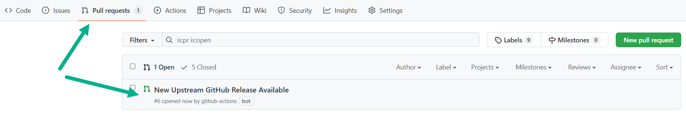

<!-- markdownlint-disable MD041 -->
## Consumer Guide

## Background

This repository has been created to help customers and partners to create, deploy and deliver landing zone Subscriptions into an Azure AD Tenant utilizing [Bicep](https://aka.ms/bicep) as the Infrastructure-as-Code (IaC) tooling and language of choice.

## Ways to Consume `bicep-lz-vending`

There are various ways to consume the Bicep modules included in `bicep-lz-vending`. The options are:

- Creating your own GitHub Repository & Utilizing the `Invoke-GitHubReleaseFetcher.ps1` script & `gh-release-checker.yml` GitHub Action Workflow
  - See detailed instruction on using this [below](#creating-your-own-github-repository--utilizing-the-invoke-githubreleasefetcherps1-script--gh-release-checkeryml-github-action-workflow)
- Use and reference the modules directly from the [Bicep Module Registry (Public)](https://github.com/Azure/bicep-registry-modules)
  - [Bicep Landing Zone (Subscription) Vending Module on Bicep Module Registry (Public)](https://github.com/Azure/bicep-registry-modules/tree/main/modules/lz/sub-vending)
  - See a live demo using the Bicep Module Registry on the [Bicep Community Call - November 2022](https://youtu.be/hu0PgCamxt0?t=1038) 📽️🎬🎞️
- Clone this repository
- Fork & Clone this repository
- Download a `.zip` copy of this repo
- Upload a copy of the locally cloned/downloaded modules to your own:
  - Git Repository
  - Private Bicep Module Registry
    - See:
      - [Create private registry for Bicep modules](https://docs.microsoft.com/azure/azure-resource-manager/bicep/private-module-registry)
  - Template Specs
    - See:
      - [Azure Resource Manager template specs in Bicep](https://docs.microsoft.com/azure/azure-resource-manager/bicep/template-specs)

The option to use will be different per consumer based on their experience and skill levels with the various pieces of technology and their features.

## Creating your own GitHub Repository & Utilizing the `Invoke-GitHubReleaseFetcher.ps1` script & `gh-release-checker.yml` GitHub Action Workflow

We have created a GitHub Action Workflow ([`gh-release-checker.yml`](https://github.com/Azure/bicep-lz-vending/blob/main/.github/workflows/gh-release-checker.yml)) and a supporting PowerShell script ([`Invoke-GitHubReleaseFetcher.ps1`](https://github.com/Azure/bicep-lz-vending/blob/main/.github/scripts/Invoke-GitHubReleaseFetcher.ps1)) that enables you to place only these 2 into a new GitHub repository and then either manually trigger the workflow or leave it to trigger on its schedule (every weekday at 00:00) and it will check for the latest releases available from this repository, `Azure/bicep-lz-vending`, and create a Pull Request into a `./releases/<VERSION>` folder in your repository.

### Steps to use this method, action & scripts

1. Create a new GitHub repository
   - See [Create a repo](https://docs.github.com/get-started/quickstart/create-a-repo) for guidance
2. Copy the [`Invoke-GitHubReleaseFetcher.ps1`](https://github.com/Azure/bicep-lz-vending/blob/main/.github/scripts/Invoke-GitHubReleaseFetcher.ps1) script into the following location in your new GitHub repository: `.github/scripts/`
3. Copy the [`gh-release-checker.yml`](https://github.com/Azure/bicep-lz-vending/blob/main/.github/workflows/gh-release-checker.yml) GitHub Action into the following location in your new GitHub repository: `.github/workflows/`
4. Commit these files into the `main` (default branch) in your GitHub repository
5. Manually trigger the GitHub action called: `Check & Pull Latest Upstream GitHub Release` from the "Actions" blade in your GitHub repository
   - Further guidance on this can be found here in [Manually running a workflow](https://docs.github.com/actions/managing-workflow-runs/manually-running-a-workflow)
6. A Pull Request should now exist on your GitHub Repository like shown below:

7. Review the Pull Request, approve and merge it into your `main` (default branch) into your GitHub repository
8. You will now have the latest release from the `Azure/bicep-lz-vending` repository available in its own folder, based on the release version number, within the `releases` folder of your GitHub repository
9. Create a `landingZones` folder in the root of your GitHub repository to contain your individual parameter files for each of the landing zone Subscriptions you wish to provision
10. You can now build your own GitHub Actions to deploy your landing zone Subscriptions based on the `main.bicep` module being available from the `./releases/<VERSION>` folder and then you are in full control of moving to newer release of the Bicep Landing Zone (aka Subscription) vending module, but the process checking and pulling in the latest release is automatically handled for you by the above mentioned GitHub Action and PowerShell script.
